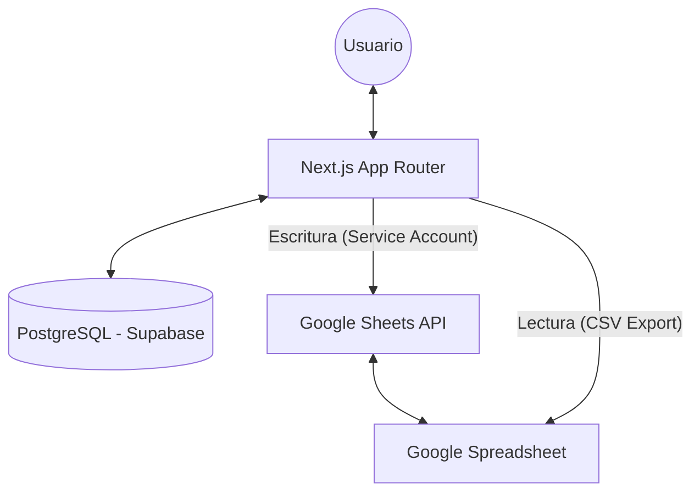
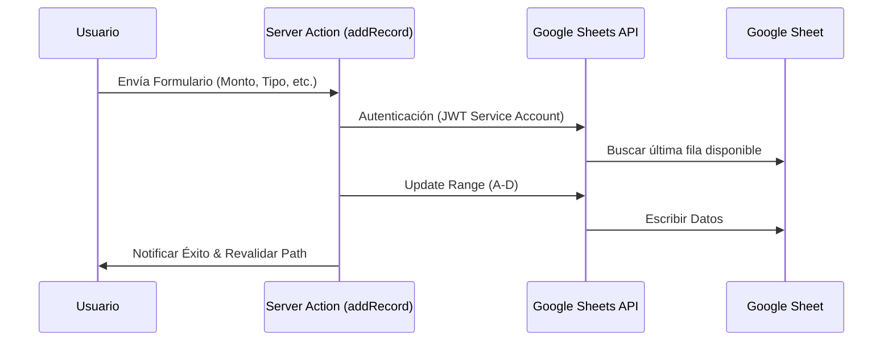

# 🏗️ Arquitectura del Sistema - Gastos App

Este documento describe la arquitectura técnica, los flujos de datos y las decisiones de diseño implementadas en la aplicación de Tesorería.

---

## 🛰️ Visión General

La aplicación sigue una arquitectura de **Next.js con App Router**, actuando como un orquestador entre una base de datos relacional (Supabase) para la gestión de usuarios y Google Sheets como la "Fuente de Verdad" para las transacciones financieras.

---

## 🛠️ Stack Tecnológico

- **Framework**: Next.js 15 (App Router).
- **Lenguaje**: TypeScript.
- **Base de Datos**: PostgreSQL (Supabase) administrado por **Prisma ORM**.
- **Autenticación**: NextAuth.js (Estrategia JWT).
- **Estilos**: Tailwind CSS 3.4.
- **Reportes**: jsPDF + jspdf-autotable.
- **Integración**: Google APIs (googleapis) & Papaparse.

---

## 🔄 Flujo de Datos Financieros

El sistema maneja los datos de forma híbrida para maximizar la velocidad de lectura y la persistencia en la nube.

### 1. Lectura de Datos (Fetch)
Para la visualización en el Dashboard y la página de registros, la aplicación consume las hojas de cálculo exportadas en formato CSV.

- **Mecanismo**: Fetch HTTP directo a la URL de exportación con `gid` específico.
- **Procesamiento**: Los datos se parsean con `Papaparse` y se normalizan en el servidor (`sheets.ts`) para manejar formatos de moneda chilena y caracteres especiales.
- **Caché**: Se utiliza `revalidatePath` para asegurar que los datos estén frescos después de una inserción.

### 2. Escritura de Datos (Insert)
Cuando un administrador registra un nuevo movimiento:

1. El cliente llama a la **Server Action** `addRecord`.
2. La acción utiliza una **Cuenta de Servicio de Google** para autenticarse.
3. Se identifica el `sheetTitle` mediante el `GID` configurado.
4. Se busca la próxima fila disponible y se insertan los valores (Fecha, Monto, Tipo, Descripción).

---

## 🔐 Seguridad y Autenticación

### Gestión de Usuarios
Los usuarios y sus roles se almacenan en Supabase. Se soporta:
- **Login Local**: Email/Password cifrado con `bcryptjs`.
- **Google OAuth**: Integración vía NextAuth.

### Protección de Rutas
Se utiliza el archivo `middleware.ts` de Next.js para interceptar las peticiones a `/dashboard`, `/records` y `/reports`. Si no hay una sesión activa, el usuario es redirigido a `/login`.

---

## 📊 Sistema de Reportes

La generación de reportes ocurre en el cliente para reducir la carga del servidor y permitir descargas instantáneas.

- **Librería**: `jsPDF`.
- **Formato**: Se generan tablas automáticas con `jspdf-autotable`.
- **Personalización**: Se incluye el logo institucional convertido a `Base64` mediante utilidades en `lib/pdf-utils.ts`.

---

## ⚙️ Configuración y Mantenimiento

### GIDs y Estructura
La aplicación depende de IDs específicos de pestañas de Google Sheets:
- `CAJA_CHICA_GID`: Por defecto `968865594`.
- `FONDO_AHORRO_GID`: Configurable vía `.env`.

### Scripts de Utilidad
Se han incluido scripts en la raíz para tareas administrativas:
- `get-all-gids.js`: Lista todos los GIDs de un documento para facilitar la configuración.
- `extract-sheets.js`: Debugging de la estructura de las hojas.
- `test-prisma.js`: Verificación de conectividad con la base de datos.

---
> [!NOTE]
> Esta arquitectura permite que la Tesorería mantenga sus datos en un Excel colaborativo mientras disfruta de una interfaz web moderna, segura y con capacidades de reporte avanzadas.
